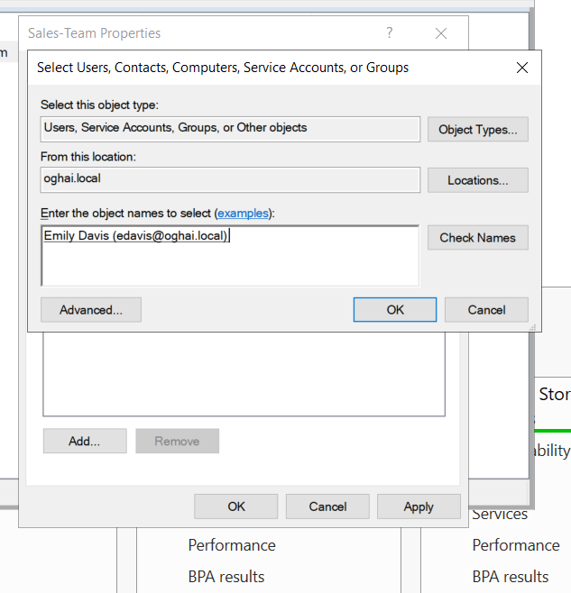
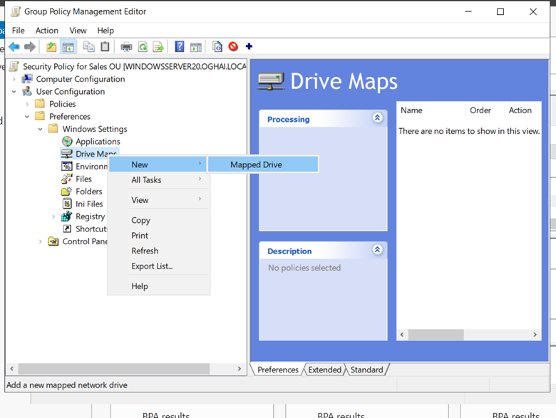

# 🏢 Active Directory & Group Policy Implementation (Windows Server 2022 on Azure)  
## 📖 Step-by-Step Implementation Guide  

---
## **📌 Step 1: Deploy an Azure Virtual Machine for Active Directory**
🔹 **Setting up an Azure VM to host Windows Server 2022 as a Domain Controller**

### **1️⃣ Create an Azure Virtual Machine**
1. Log in to the **Azure Portal**: [https://portal.azure.com](https://portal.azure.com)
   


3. Navigate to **Virtual Machines** → Click **Create**.
4. Choose the following configuration:
   - **Subscription**: Select your Azure subscription.
   - **Resource Group**: Create a new or select an existing one.
   - **Virtual Machine Name**: `WindowsServer20`
   - **Region**: Select a close region (e.g., East US, West Europe).
   - **Image**: **Windows Server 2022 Datacenter**
   - **Size**: Standard B2s or higher.
   - **Administrator Username & Password**: Set strong credentials.
   - **Inbound Ports**: Allow **RDP (3389)**.

 <br>

  <br>

  <br>

  <br>

   
5. Click **Review + Create** → Wait for Deployment to finish.

 

---

### **2️⃣ Connect to the Azure Virtual Machine**
1. In **Azure Portal**, go to **Virtual Machines**.
2. Click on **WindowsServer20** → Select **Connect > RDP**.
3. Download the **RDP file** and open it.
4. Log in using the credentials set during VM creation.


---

### **3️⃣ Configure Static Private IP Address**
🔹 *Note: The virtual machine was automatically assigned a private IP during creation.*

1. In **Azure Portal**, navigate to **Networking** for the VM.
2. Click on the **Network Interface**.
3. Select **IP Configuration** → Click on the **IP Address**.
4. If the IP assignment is **Dynamic**, change it to **Static**.
5. Click **Save**.


---

## **📌 Step 2: Install Active Directory Domain Services (AD DS)**

You can install **Active Directory Domain Services (AD DS)** using either the **Server Manager GUI** or **PowerShell**.

### **Option 1: Install via Server Manager**
1. Open **Server Manager** on the Azure VM.
2. Click **Manage** → Select **Add Roles and Features**.
3. Select **Role-based or feature-based installation** → Click **Next**.
4. Choose **Select a server from the server pool** → Click **Next**.
5. Select **Active Directory Domain Services (AD DS)** → Click **Next**.
6. Click **Install** and wait for the installation to complete.

### **Option 2: Install via PowerShell**
Alternatively, you can install AD DS using the following PowerShell command:


```powershell
Install-WindowsFeature -Name AD-Domain-Services -IncludeManagementTools
```


7. Once installed, **Promote the server to a Domain Controller**:
   - Open **Server Manager** → Click on the notification flag.
   - Select **Promote this server to a domain controller**.


   - Choose **Add a new forest**, enter the **Root Domain Name (e.g., oghai.local)**.

     

     
   - Set a **Directory Services Restore Mode (DSRM) password**.

     

   - Click **Next** and complete the installation.
     
   - The server will restart automatically.

     

     

    


---

## **📌 Step 3: Create Organizational Units (OUs)**
1. Open **Active Directory Users and Computers (ADUC)** or type **dsa.msc** in **Run** .


2. Navigate to **yourdomain.local**.


3. Right-click on the domain name → Select **New > Organizational Unit**.

 

 


4. Create the following OUs:
   - **Sales**
   - **IT**
   - **Finance**
   - **HR**


5. Click **OK** to save.

---

## **📌 Step 4: Create Users and Groups**
1. Open **Active Directory Users and Computers**.
2. Navigate to **Sales OU**.
3. Right-click **Sales OU** → Select **New > User**.
4. Fill in the details:
   - **First Name**: John  
   - **Last Name**: Doe  
   - **User Logon Name**: jdoe
     


5. Set a password and choose **User must change password at next logon**.


7. Repeat the same process for other users.


9. Create a **Security Group for Sales Team**:
   - Right-click **Sales OU** → Select **New > Group**.
   - Group Name: **Sales-Team** → Select **Global & Security**.


   - Click **OK**.

### **📌 Adding Users to Groups**
To add members to a security group:
1. Open **Active Directory Users and Computers**.
2. Navigate to the **Sales OU** and locate the **Sales-Team** group.
3. Right-click the group → Select **Properties** → Go to the **Members** tab.




4. Click **Add...** and enter the user’s name (e.g., **Emily Davis**).
   


5. Click **Check Names** → **OK** to add the user.
6. Repeat for additional users as needed.
7. Click **Apply** → **OK** to save changes.


### **🔄 Moving a User to a Different Organizational Unit (OU)**
> If a user is created in the domain and is not assigned to the correct OU during creation, you can move them later.

1. Open **Active Directory Users and Computers (ADUC)**.
2. Locate the user in the **Users** container or another incorrect OU.
3. Right-click the user and select **Move**.
4. Choose the **destination OU** (e.g., Sales, IT, Finance).
5. Click **OK** to complete the move.


✅ This ensures that users are properly structured under the correct organizational units for better policy management.


---

## **📌 Step 5: Install & Configure Group Policy Management**
1. Open **Server Manager**.
2. Click **Manage > Add Roles and Features**.
3. Select **Group Policy Management** → Click **Install**.
4. Once installed, open **Group Policy Management Console (GPMC)** or type **gpmc.msc** in **Run**.


6. Navigate to **Forest: yourdomain.local > Domains > yourdomain.local**.


---

## **📌 Step 6: Create & Link a Group Policy Object (GPO)**
1. In **GPMC**, right-click on **Group Policy Objects** → Select **New**.
2. Name the new GPO: **Security Policy for Sales OU**.


3. Right-click the new GPO → Select **Edit**.


4. Modify settings as needed.

---

## **📌 Step 7: Configure Password Policy for Users**
1. In **GPMC**, navigate to:  
   **Computer Configuration > Policies > Windows Settings > Security Settings > Account Policies > Password Policy**.


2. Modify the following:
   - **Enforce password history**: 5 passwords remembered.


Enforce_Password_history_Properties
   - **Maximum password age**: 90 days.


   - **Minimum password length**: 10 characters.


   - **Password complexity requirements**: Enabled.


4. Click **OK** and close.

---

## **📌 Step 8: Restrict USB Drive Access for Finance & HR**
1. Navigate to:  
   **Computer Configuration > Policies > Administrative Templates > System > Removable Storage Access**.


2. Enable:
   - **All Removable Storage classes: Deny all access**.


3. Click **OK**.

---

## **📌 Step 9: Map Network Drive for Sales Team**
1. Navigate to:  
   **User Configuration > Preferences > Windows Settings > Drive Maps**.



3. Right-click **Drive Maps** → **New > Mapped Drive**.
4. Set the following:
   - **Location**: `\\Server\SharedSales`
   - **Reconnect**: Yes
   - **Label**: Sales Shared Drive
   - **Drive Letter**: S:


5. Click **Apply** and **OK**.

---

## **📌 Step 10: Prevent IT Users from Changing Desktop Background**
1. In **GPMC**, create a new GPO: **"IT Group Policy"**.
2. Navigate to:  
   **User Configuration > Policies > Administrative Templates > Control Panel > Personalization**.


4. Enable:
   - **Prevent changing desktop background**.
5. Click **Apply** and **OK**.


---

## **📌 Step 11: Link Group Policy to Organizational Units (OUs)**
1. In **GPMC**, find the OU (e.g., Sales OU, IT OU).


3. Right-click the OU → Select **Link an Existing GPO**.


4. Choose the appropriate GPO → Click **OK**.

---

## 📌 Step 11: Apply Group Policy to All OUs and Allow Logon Through Remote Desktop Services

1. In **Group Policy Management Console (GPMC)**, create a new GPO named **"Company Policies"**.
2. Right-click **Group Policy Objects** → Select **New**.
3. Name the new GPO: **Company Policies** → Click **OK**.


4. Right-click **Company Policies** → Select **Edit**.
5. Navigate to:  
   **Computer Configuration > Policies > Windows Settings > Security Settings > Local Policies > User Rights Assignment**.
6. Find **Allow log on through Remote Desktop Services** and open it.

   

8. Click **Add User or Group** and enter the required usernames or groups (e.g., IT Admins, specific users).
9. Click **Check Names** to validate the users and then click **OK**.


10. Click **Apply** and **OK** to save the changes.
11. Close the **Group Policy Management Editor**.
12. Right-click **Company Policies GPO** → Select **Link an Existing GPO**.
13. Link the GPO to the **Root Domain (oghai.local)** to apply it to all OUs.

---

Now, this **Company Policies** GPO ensures that all OUs inherit these settings, including allowing designated users to log on through Remote Desktop Services.


---

## 📌 Final Steps: Apply & Verify GPOs 🛠️

1. Open **Command Prompt (cmd)** or **PowerShell**.
2. Force apply the policies:
   ```powershell
   gpupdate /force
   ```
   

3. **Test the Implemented Policies:**
   - Close the **Remote Desktop Connection**.
   - Log in again using **user credentials**.
   - Verify that the **configured Group Policies** are applied as expected.

---

### 🔹 **Troubleshooting**
- If the policies do not apply immediately, try logging out and logging back in.
- Run the command `gpresult /r` in **Command Prompt** to check the applied policies.
- Ensure that the GPO is properly linked to the **correct Organizational Unit (OU)** in **Group Policy Management Console (GPMC)**.
- Restart the computer if necessary.

This ensures that **users are correctly assigned the permissions and restrictions** set by the Group Policies. If any issues arise, re-run the `gpupdate /force` command or check the **GPO link status** in Group Policy Management Console (GPMC).


