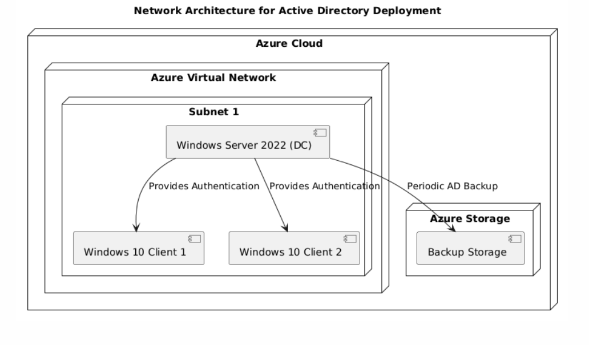
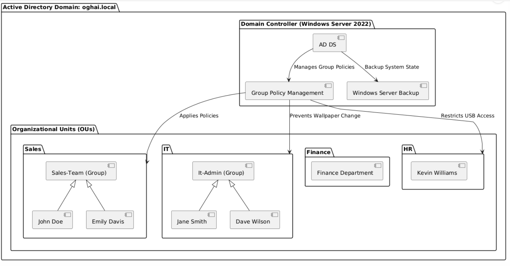

# 🏢 Active Directory Deployment on Azure

This project demonstrates the **setup and configuration of Active Directory Domain Services (AD DS) on Windows Server 2022**, hosted on **Azure Virtual Machines**. It covers **Organizational Units (OUs), Group Policies (GPOs), and User Management**, ensuring a structured domain environment.

---

## 📌 Project Overview

- **Domain Name:** `oghai.local`
- **Deployment Type:** Azure Virtual Network
- **Domain Controller:** Windows Server 2022
- **Clients:** Windows 10 Machines
- **Key Features:**
  - **Active Directory Structure** (OUs, Users, Groups)
  - **Group Policy Management**
  - **Security & Access Control**
  - **Remote Desktop Access Policies**
  - **Backup & Recovery Considerations**

For **detailed implementation steps, technologies used, and future enhancements**, please refer to:

📖 **[Project Overview](Documentation/Project-Overview.md)**

---

## 🖥️ Network & AD Structure

### 🔹 **Network Architecture**


- Windows Server 2022 as **Domain Controller (DC)**
- Azure Virtual Network with Subnet
- Windows 10 Clients joined to the **Active Directory**
- Azure Storage for **AD Backup**

### 🔹 **Active Directory Organizational Units**


- **Sales OU**
  - Group: `Sales-Team`
  - Users: `John Doe, Emily Davis`
- **IT OU**
  - Group: `IT-Admins`
  - Users: `Jane Smith, Dave Wilson`
- **Finance & HR OUs**
  - Users: `Kevin Williams`

---

## 🚀 Deployment Steps

A **detailed step-by-step guide** covering:
✅ **Active Directory Setup**  
✅ **User & Group Management**  
✅ **Static IP Configuration**  
✅ **Group Policy Objects (GPOs)**  
✅ **Backup & Security Policies**  

📖 **Refer to**: [`Step-by-Step Guide`](Documentation/Step-by-Step-Guide.md)


## ✅ Final Testing & Verification

1. Run:
   ```powershell
   gpupdate /force
   ```
2. Log in as a **domain user** and verify:
   - Group policies are applied.
   - Remote Desktop Access settings work as expected.

---

## 📌 Troubleshooting

- Run `gpresult /r` to check applied policies.
- Restart the machine if policies don't apply immediately.
- Ensure **GPOs are linked correctly** in the Group Policy Management Console.

---

The issue is that GitHub's Markdown renderer collapses consecutive spaces and does not support traditional ASCII tree structures well in preview mode. To fix this, you can use **code blocks (` ``` `) around the structure**, ensuring it maintains proper formatting in preview mode.


## 📂 Project Structure

/Active-Directory-Project  
├── **Diagrams/**  
│   ├── AD-Structure.png  
│   ├── Network-Architecture.png
│  
├── **Documentation/**  
│   ├── Project-Overview.md ← *(Implementation, Technologies Used, Enhancements)*  
│   ├── Step-by-Step-Guide.md ← *(Installation & Configuration)*  
│  
├── **Screenshots/** ← *(Contains all images documenting each step, including: Azure VM Setup, AD Configuration, User Management, Group Policies, etc.)*  
│  
├── **Scripts/**  
│   ├── AD-User-Creation.ps1 ← *(Automates user creation in AD)*  
│   ├── Backup-Restore-AD.ps1 ← *(Handles AD backup & restoration)*  
│   ├── Group-Policy-Setup.ps1 ← *(Applies predefined GPO settings)*  
│  
└── **README.md** ← *(You are here)*


---

## 📢 Author

📝 Created by **Ojas Ghai** | **Azure | Active Directory | IT Security**

🔗 **GitHub Repository:** [Active Directory Project](https://github.com/OjasGhai/Active-Directory-Project)

---

### **Why This README?**
✔️ **References `Project-Overview.md` for deeper insights**  
✔️ **Keeps step-by-step details in `Step-by-Step-Guide.md`**  
✔️ **Uses Diagrams and Screenshots to enhance understanding**
✔️ **Ensures clarity with a structured format**
